# Project Report - A* Search Algorithm (8-puzzle problem)

### Submitted By:
**Jawad Chowdhury**

---

## Report Pages

### Page 1&2
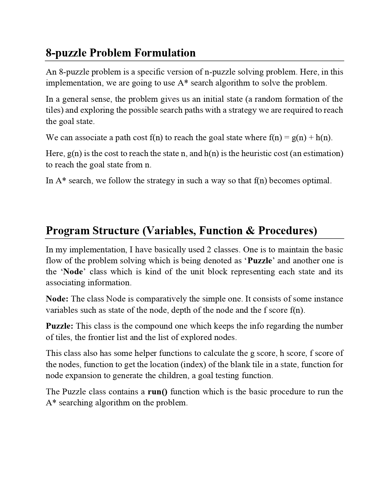

### Page 3
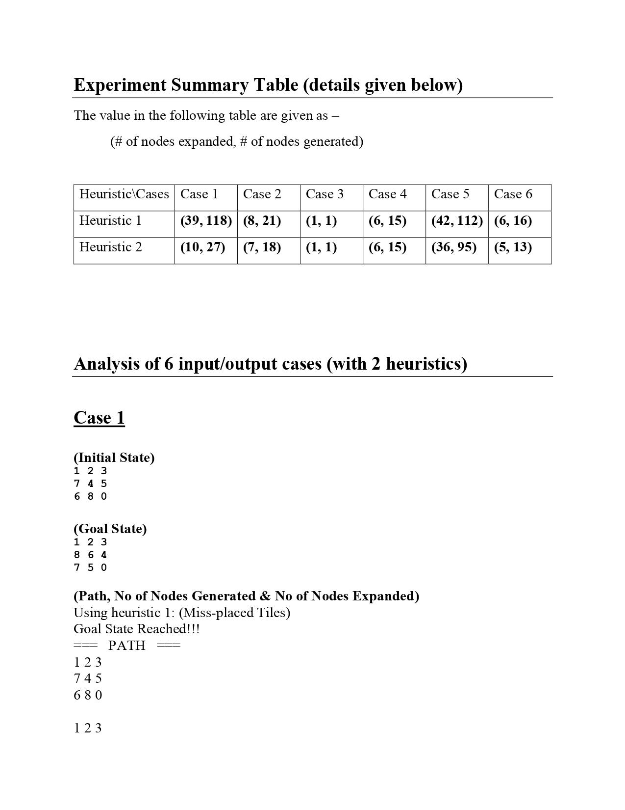

### Page 4
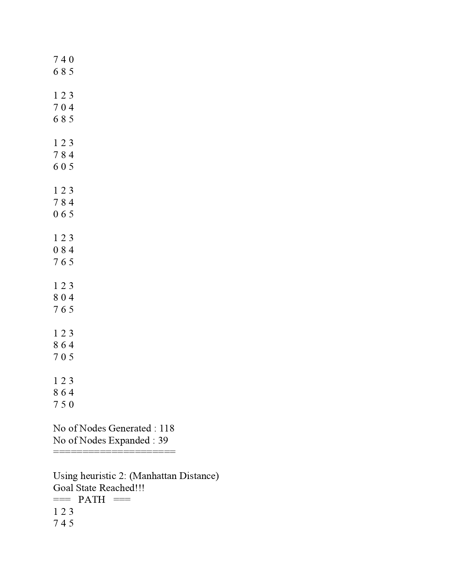

### Page 5
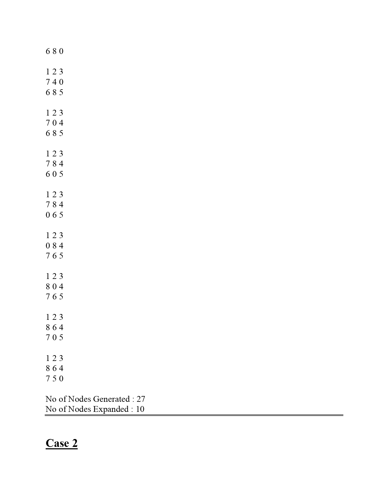

### Page 6
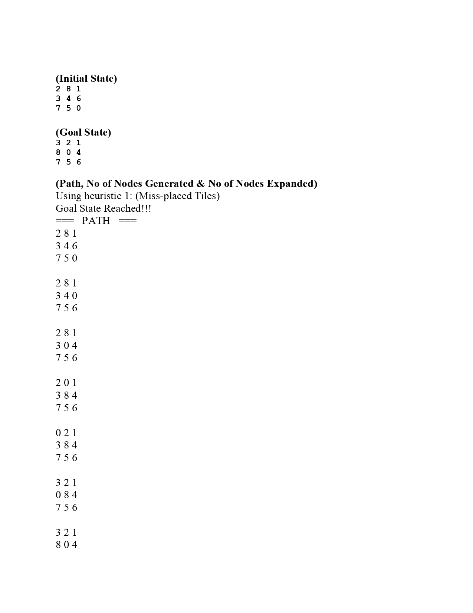

### Page 7
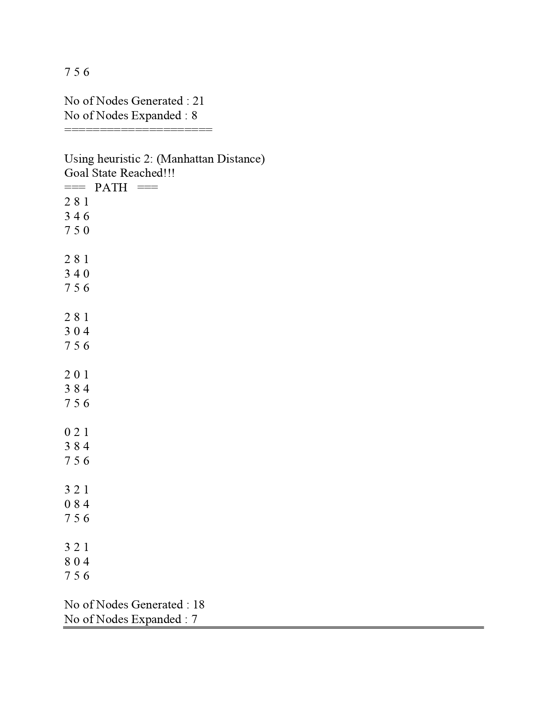

### Page 8
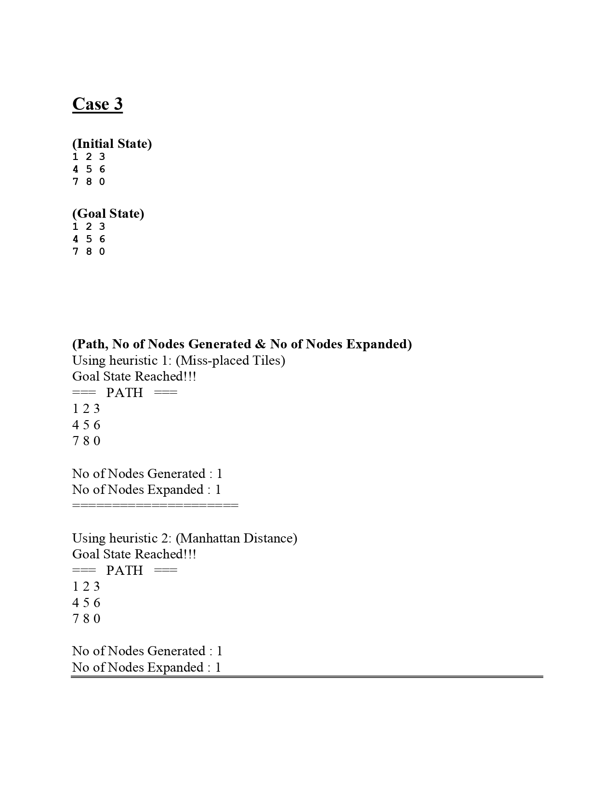

### Page 9
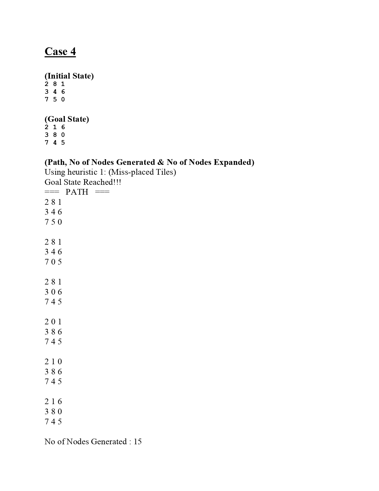

### Page 10
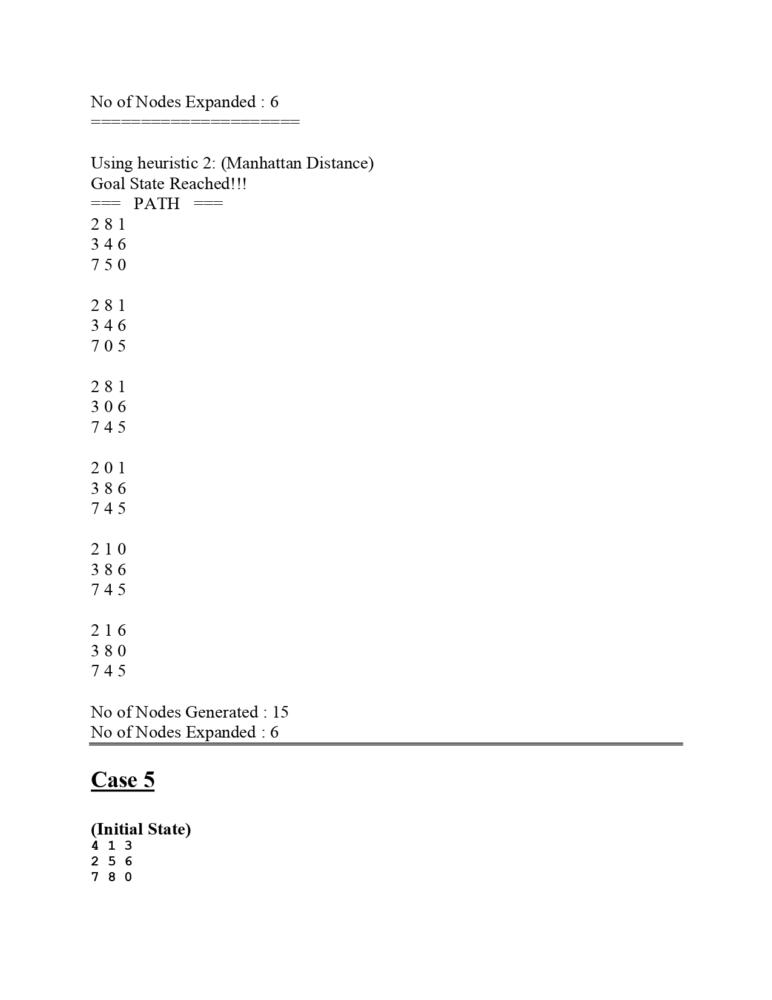

### Page 11
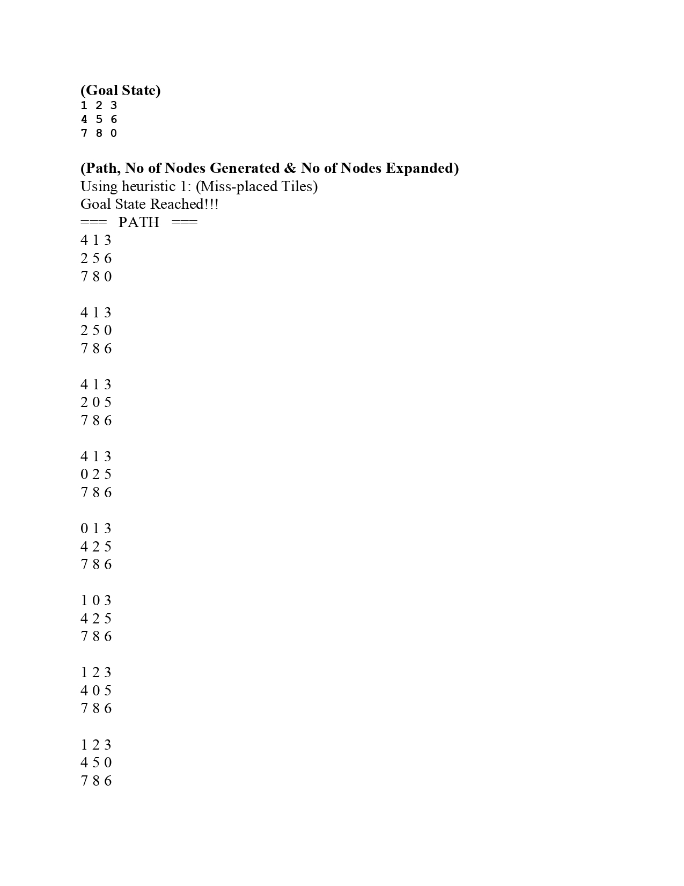

### Page 12
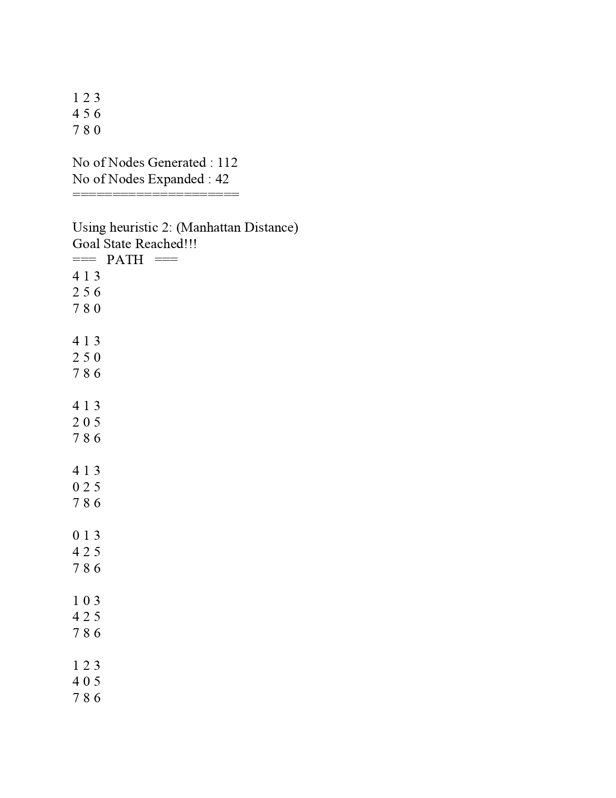

### Page 13
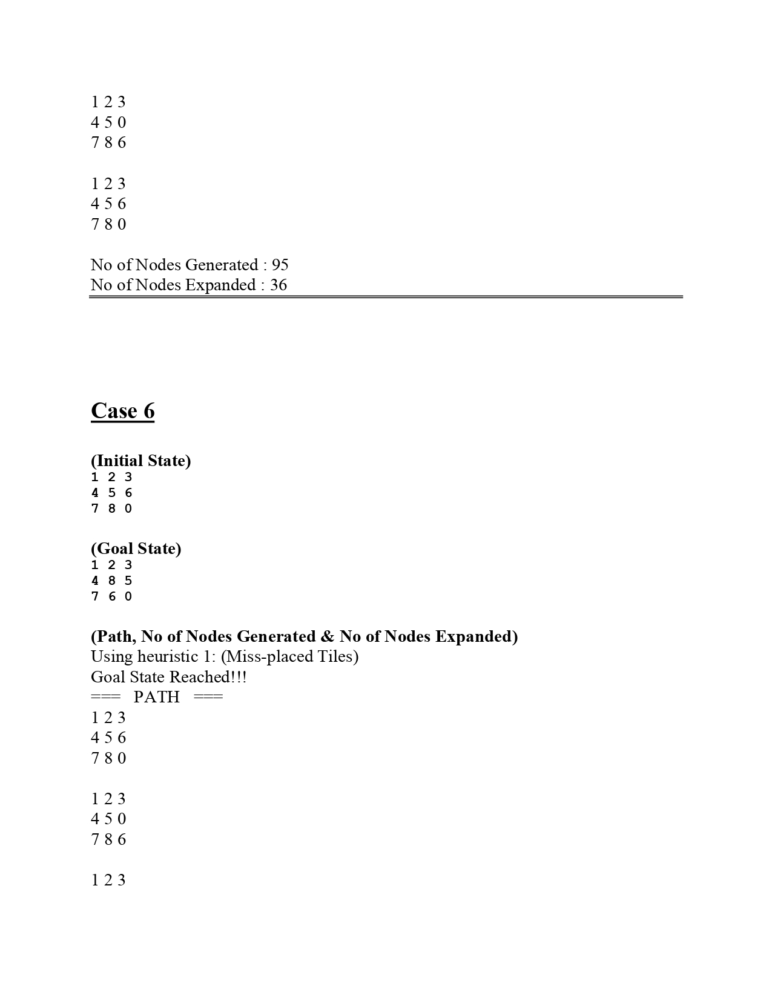

### Page 14
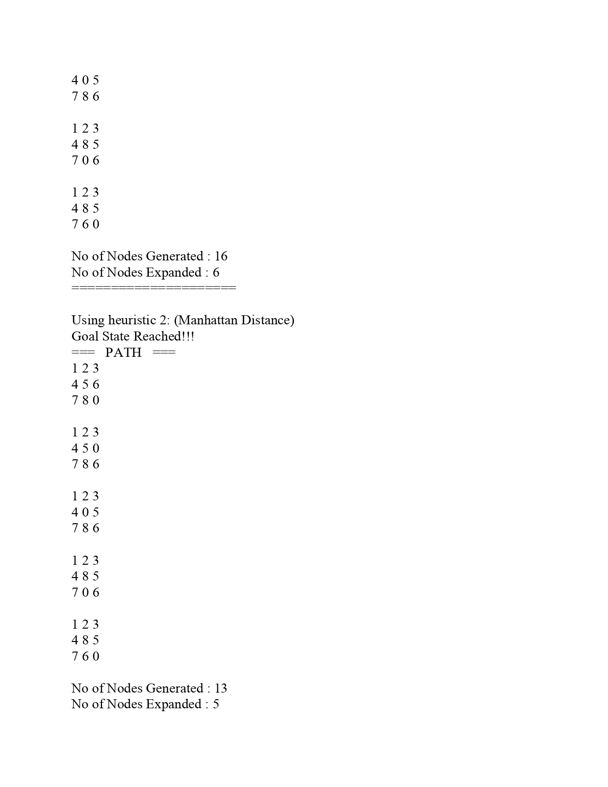

### Page 15

---

